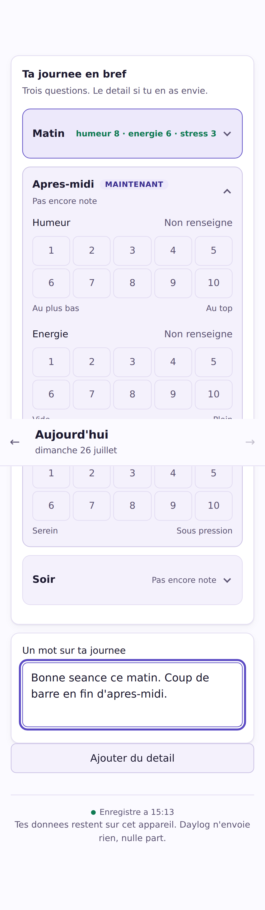

# Daylog

Suivi quotidien — humeur, sommeil, habitudes, alimentation.
**Tes données restent sur ton appareil. L'application n'envoie rien, nulle part.**

État : socle en cours de construction. Utilisable, mais loin d'être complet.



## Ce que c'est

Un carnet de suivi quotidien pensé pour être tenu **vraiment**, sur la durée :

- **Une journée utile en 60 secondes.** Trois questions à l'ouverture. Le détail
  seulement si on en a envie.
- **Aucune donnée ne sort.** Pas de compte, pas de serveur, pas de publicité,
  pas de traceur. L'application n'émet aucune requête réseau — et
  [un test automatique le vérifie](scripts/smoke.js) à chaque fois.
- **Léger.** 29 Ko chargés au total, aucune dépendance à l'exécution. Pensé pour
  les téléphones anciens ou presque pleins.
- **Utilisable par tout le monde.** Navigation clavier, lecteurs d'écran,
  contrastes conformes, et l'interface suit la taille de police réglée sur
  l'appareil.

## Ce que ce n'est pas

Un outil de suivi, **pas un dispositif médical**. Aucun diagnostic, aucun
conseil thérapeutique, aucun remplacement d'un professionnel de santé.

Aucune intelligence artificielle. Tous les calculs sont des formules décrites
dans [la documentation](docs/) et lisibles dans le code.

## L'essayer

Voir **[docs/deploiement.md](docs/deploiement.md)** — trois façons, de la plus
simple (une adresse à ouvrir sur son téléphone) à la plus technique.

En local :

```bash
npm install
npm run dev      # l'adresse en 192.168.x.x s'ouvre depuis un téléphone
npm run build    # version de production dans dist/
```

## Vérifier

```bash
npm test                  # 61 tests unitaires
npm run test:timezones    # la suite complète dans 10 fuseaux horaires
npm run smoke             # 64 vérifications dans un vrai navigateur
npm run verify            # tout l'enchaînement
```

Le test de bout en bout intercepte toutes les requêtes réseau et **échoue s'il
en sort une seule**.

## Principes de conception

Ils tranchent les arbitrages, dans cet ordre :

1. **Rien ne sort de l'appareil.** Toute fonctionnalité qui exigerait un serveur
   doit d'abord chercher une solution sans serveur.
2. **On n'invente jamais une donnée.** Un champ non renseigné vaut « non
   renseigné », jamais une valeur moyenne. Il est exclu des calculs, et
   s'affiche « — ».
3. **On ne perd jamais une donnée.** Sauvegarde automatique, export gratuit et
   complet, historique immuable, format versionné et migrable.
4. **On ne culpabilise personne.** Pas de série de jours qui se casse, pas
   d'objectif manqué en rouge, pas de relance. Rater trois semaines ne doit
   rien abîmer.
5. **L'accessibilité fait partie du socle**, pas du polissage. C'est ce que
   « inclusif » veut dire concrètement, avant le vocabulaire.

## Documentation

- [Architecture du socle](docs/architecture.md) — les décisions et ce qui les a
  motivées
- [Calculs métaboliques](docs/calculs-metaboliques.md) — les formules, et
  pourquoi l'identité de genre n'entre dans aucune d'elles

## Sauvegardes

Tout étant local, **perdre l'appareil signifie perdre les données**. L'export
produit un fichier compressé que l'on range où l'on veut — Drive, iCloud, une
clé USB. L'application ne touche pas au réseau : c'est le système qui envoie le
fichier.

L'export est gratuit, complet et sans limite de durée. Il le restera : faire
payer l'accès à ses propres données serait contraire à tout le reste.

## Licence

MPL-2.0. Le code est ouvert parce que c'est le seul moyen de **prouver** qu'aucune
donnée ne sort : n'importe qui peut le vérifier.
