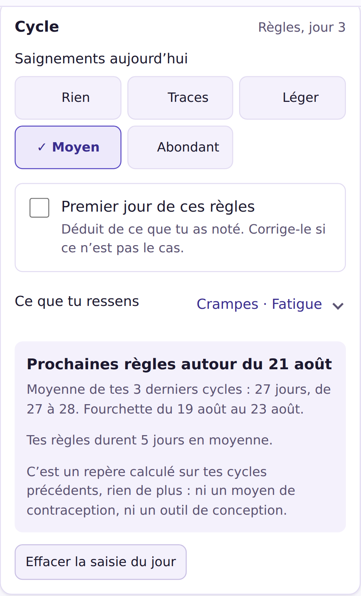
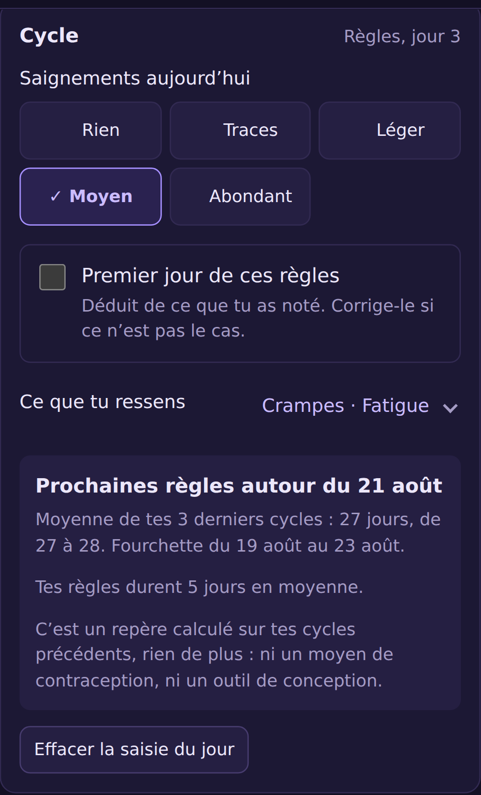

# Suivi du cycle menstruel

Ce document explique **tous** les calculs du module cycle, et surtout ce que
Daylog refuse de calculer. C'est, avec les calculs métaboliques, le sujet le
plus intime de l'application : il doit donc être le plus transparent.

<p>
  
  
</p>

Aucune intelligence artificielle n'intervient. Tout ce qui suit tient en une
poignée d'additions et de moyennes, lisibles dans
[`src/core/cycle.js`](../src/core/cycle.js) et vérifiées par 44 tests.

## Les quatre règles

> **1. Rien n'est écrit que la personne n'ait saisi.**
> **2. Rien n'est affirmé sans données pour le soutenir.**
> **3. Aucune fertilité, aucune ovulation, aucune phase clinique.**
> **4. Le module ne suppose jamais le genre de qui l'utilise.**

## Comment le module s'active

Il n'y a **aucune case « sexe » dans Daylog**, et le module ne se déclenche pas
sur l'identité déclarée. Il s'active sur une question posée à tout le monde à
la première ouverture :

> As-tu un cycle menstruel à suivre ?
> · Oui, plutôt régulier · Oui, irrégulier · Oui, mais suspendu · Non, pas
> concerné

C'est la seule formulation qui soit juste à la fois pour une femme qui n'a pas
de cycle — ménopause, hystérectomie, traitement — et pour une personne trans ou
non binaire qui en a un. Une case « sexe » se serait trompée dans les deux sens
à la fois.

La question peut être passée, et la réponse change à tout moment dans le profil.
Une fois le module visible, il se désactive comme n'importe quel autre suivi,
**sans condition** : ses données restent enregistrées, simplement masquées.

## Ce qui est enregistré

| Champ | Valeurs | Sens |
|---|---|---|
| `flow` | 0 à 4 | rien, traces, léger, moyen, abondant |
| `symptoms` | liste d'identifiants | ce que la personne a coché |
| `cycleStart` | `true` / `false` / absent | correction manuelle du début de cycle |

`flow: 0` (« rien aujourd'hui ») et l'absence de `flow` (« pas noté ») sont deux
informations différentes, comme partout ailleurs dans l'application. La première
est une réponse, la seconde n'en est pas une.

## Les débuts de cycle sont déduits, pas déclarés

C'est la décision structurante du module.

**Le problème.** Demander de cocher « premier jour » a l'air simple et ne l'est
pas : oublié une seule fois, tous les repères suivants sont décalés de plusieurs
semaines, sans que rien ne le signale. La personne ne voit qu'une application
qui se trompe.

**La règle.** Un jour ouvre un cycle s'il porte du saignement (`flow ≥ 1`) et
qu'aucun jour saignant ne le précède de **3 jours ou moins**.

Cette tolérance de 3 jours existe parce que des règles s'interrompent une
journée, et surtout parce qu'on oublie de noter. Sans elle, un jour manquant
coupait l'épisode en deux et fabriquait un « cycle » de trois jours qui ruinait
la moyenne.

**La correction reste possible.** Une case « Premier jour de ces règles »
apparaît dès qu'un saignement est noté. Elle est **pré-cochée d'après la
déduction, mais rien n'est écrit tant qu'on n'y touche pas** : la fiche du jour
ne contient un `cycleStart` que si la personne a explicitement corrigé. Revenir
sur sa correction rend la main à la déduction automatique.

### Deux débuts trop rapprochés n'en font qu'un

Un saignement isolé douze jours après le précédent est un événement
intermenstruel, pas un cycle. Le compter comme tel diviserait la moyenne par
deux. Deux débuts séparés de **moins de 12 jours** sont donc fusionnés — on
garde le premier, c'est lui qui date le cycle.

Le seuil est volontairement bas : des cycles courts existent, et les effacer
serait pire que de laisser passer un épisode.

## Les moyennes

```
longueur d'un cycle = nombre de jours d'un début au début suivant
durée moyenne       = moyenne des 6 derniers cycles retenus
```

**Ce qui est écarté de la moyenne** : les longueurs de plus de **90 jours**. Un
cycle de six mois n'existe pas ; c'est presque toujours une interruption de
suivi. La longueur reste visible dans l'historique, elle ne sert simplement pas
de référence.

Le seuil est haut à dessein. Des cycles réellement longs sont la réalité de
beaucoup de gens (SOPK, périménopause), et les écarter serait leur dire que
leur corps est une erreur de saisie.

### Noter uniquement pendant ses règles suffit

C'est même l'usage le plus léger, et il est pleinement supporté : les débuts de
cycle se déduisent des seules journées où un saignement est noté. Les journées
sans saisie ne sont pas des zéros, elles sont simplement absentes — ouvrir
l'application quatre jours par mois donne exactement les mêmes repères qu'un
suivi quotidien.

Reste un cas : **un mois entier oublié**. Daylog voit alors un « cycle » de 56
jours là où il y en a eu deux de 28, et cette longueur doublerait la moyenne.

Une longueur d'au moins **1,75 fois la médiane des autres** est donc écartée du
calcul, comme probablement incomplète. La comparaison se fait avec la médiane
des *autres* longueurs, pas de l'ensemble : une valeur aberrante tire la
médiane vers elle et finirait par se justifier toute seule.

Trois précautions, parce que se tromper ici revient à effacer une réalité :

- il faut **au moins trois longueurs**, donc une idée de ce qui est habituel ;
- un cycle **déclaré irrégulier n'est jamais concerné**. Chez quelqu'un dont les
  cycles vont de 25 à 50 jours, un cycle long n'est pas une erreur de saisie,
  c'est son corps — et l'écarter reviendrait à lui dire le contraire ;
- **rien n'est effacé** : la longueur reste dans l'historique, et la carte dit
  combien d'intervalles ont été mis de côté, et pourquoi.

**La durée des règles** se mesure de la même façon, sur les épisodes terminés.
L'épisode en cours est mis de côté : sans cette précaution, ouvrir
l'application le premier jour de ses règles faisait chuter la moyenne à chaque
cycle.

## Le repère de prochaines règles

```
date attendue = dernier début + durée moyenne
fourchette    = date attendue ± demi-largeur
demi-largeur  = max(plancher, (plus long − plus court) ÷ 2)
```

| Situation | Ce qui s'affiche |
|---|---|
| Moins de 2 cycles complets, sans durée annoncée | Rien, et on dit pourquoi |
| Durée annoncée à la première ouverture | Une fourchette, largeur ≥ 4 jours |
| 2 cycles ou plus, réguliers | Une date, avec sa fourchette (± 2 jours) |
| 2 cycles ou plus, dispersés | Une fourchette qui suit la dispersion |
| Cycles déclarés irréguliers | Toujours une fourchette, jamais une date |
| Dispersion de plus de 40 jours | Rien : aucune fourchette n'aurait de sens |
| Cycle déclaré suspendu | Rien : une moyenne ne prédirait rien |
| Repère refusé dans le profil | Rien, nulle part |

**Le plancher de 2 jours** existe parce que même trois cycles identiques ne
justifient pas d'annoncer une date au jour près.

**Un cycle déclaré irrégulier n'annonce jamais de date**, même si les trois
derniers cycles tombent juste. La personne sait mieux que l'application ce
qu'ils valent.

**La durée annoncée cède la place aux faits** dès qu'il y a deux cycles
observés. C'est un point de départ — sans lui, l'application n'aurait rien à
dire pendant deux mois — jamais une référence permanente.

### Le retard

**Il se compte à partir du haut de la fourchette**, pas de la date centrale :
tant qu'on est dans la fourchette annoncée, il n'y a rien à signaler.

Au-delà, un bandeau apparaît. Il monte en **précision**, jamais en gravité :

| Palier | Quand | Ce qui est dit |
|---|---|---|
| — | dans la fourchette | rien |
| `late` | au-delà | « Repère dépassé de N jours. Un cycle qui se décale est courant. » |
| `long` | à partir de 22 jours | la même chose, plus : une journée a peut-être été oubliée — la compléter recalcule le repère |

Un cycle déclaré **irrégulier n'atteint jamais le second palier**. Chez
quelqu'un dont les cycles varient de trente jours, un mois d'écart n'est pas un
événement, et le lui signaler reviendrait à lui rappeler tous les mois que son
corps ne rentre pas dans la moyenne.

Il n'y a pas de troisième palier, et aucune couleur d'alerte — ni rouge, ni
orange. Au-delà de « une journée a peut-être été oubliée », l'application
n'a rien à dire : la suite serait un diagnostic.

**Un bouton « C'est normal »** fait taire le bandeau pour le cycle en cours et
pour ce palier. Il existe surtout pour les deux cas où le repère se trompe le
plus : les premiers mois, quand Daylog ne connaît pas encore le cycle, et les
cycles qui ne rentrent dans aucune moyenne. Le refus ne suit pas la personne
d'un cycle à l'autre.

## Ce que Daylog ne calculera pas

### Aucune fenêtre de fertilité, aucune ovulation

Daylog ne connaît que des dates de saignement. En déduire une ovulation, c'est
**fabriquer une information médicale à partir de rien**.

Le risque n'est pas théorique : des gens s'en serviraient comme moyen de
contraception. C'est la méthode du calendrier, dont l'échec est fréquent — et
une application de suivi n'a pas à endosser cette responsabilité.

Une vérification de bout en bout échoue si les mots « fertilité », « ovulation »,
« lutéal », « folliculaire » ou « nidation » réapparaissent un jour à l'écran.

### Aucune phase clinique nommée

Le cahier des charges demandait « les phases ». Elles sont là, mais dites en
langage courant : **« avant les règles »**, **« après les règles »**.

Nommer la phase lutéale affirmerait qu'une ovulation a eu lieu. C'est faux pour
une partie des cycles — contraception hormonale, SOPK, périménopause,
post-partum — et l'affirmer à ces personnes serait à la fois inexact et
blessant.

Les repères affichés portent la mention « repère, pas une mesure » dès qu'ils
sont déduits d'une moyenne plutôt que lus dans une saisie.

### Aucune invitation à consulter déclenchée par un seuil

La question s'est posée : au-delà d'un très grand retard, ne faudrait-il pas
suggérer d'en parler à un médecin ? L'intention est bonne, la mise en œuvre ne
l'est pas.

Un message déclenché par un seuil dit, en creux : **« ton cycle sort de la
norme »** — à partir d'une moyenne arithmétique, et sans rien savoir de ce qui
se passe. Grossesse, arrêt de contraception, périménopause, post-partum,
allaitement, traitement hormonal, perte de poids, entraînement intensif, stress,
ou tout simplement des règles arrivées sans être notées : Daylog ne distingue
aucun de ces cas. Pour beaucoup de gens, un tel message se lit d'ailleurs
comme un test de grossesse déguisé — exactement l'inférence médicale qu'on a
refusé de faire partout ailleurs.

La phrase existe donc, mais **dans « Comment ça marche »**, en permanence et
sans condition :

> Daylog ne juge aucun cycle : ni trop long, ni trop court, ni irrégulier. Il
> ne sait pas ce qu'un retard signifie pour toi, et il ne le devinera pas. Si
> quelque chose t'inquiète, c'est à un professionnel de santé d'en parler — et
> tes saisies s'exportent en un fichier que tu peux lui montrer.

Disponible pour qui la cherche, elle ne vise personne. Et l'aide concrète que
l'application peut réellement apporter — un export complet à montrer — est dans
la même phrase.

Une vérification de bout en bout échoue si les mots « consulte », « médecin »
ou « anormal » apparaissent dans un message déclenché par les données.

À revoir au moment des essais, avec l'avis des personnes concernées.

### Aucun diagnostic, aucun conseil

Daylog ne dit pas qu'un cycle est trop long, trop court ou irrégulier. Il
affiche ce qui a été noté et la moyenne de ce qui a été noté. Un cycle très
variable est présenté comme une information — « c'est une information en soi,
et elle peut intéresser un professionnel de santé » — jamais comme un problème.

## Choix d'interface

**Aucune couleur dédiée, et surtout pas de rose.** Le module emprunte
exactement la palette des habitudes et de l'hydratation. Le teinter reviendrait
à désigner qui est censé s'en servir.

**Le titre affiché sur l'écran du jour est « Cycle »**, pas « Cycle menstruel » :
c'est l'écran qu'on ouvre dans le métro. Le libellé complet reste dans les
réglages et dans l'export, là où il faut savoir exactement de quoi on parle.

**Le repère peut être refusé.** Un compte à rebours avant les prochaines règles
n'est pas souhaitable pour tout le monde — parcours de PMA, fausse couche, ou
simplement pas envie. Ce n'est pas à l'application d'en décider.

**Le choix d'intensité suit le motif ARIA `radiogroup`** : une seule tabulation
pour entrer dans le groupe, puis les flèches. Cinq boutons ordinaires feraient
cinq arrêts de tabulation à traverser tous les jours pour qui navigue au
clavier ou avec un contacteur.

## Partage

Le module est marqué `shareable` : trois mois de suivi de cycle peuvent être
exportés **seuls**, pour une consultation, sans emporter le journal intime ni
les check-ins d'humeur. Comme tout le reste, le fichier est remis au système —
l'application ne l'envoie nulle part.
